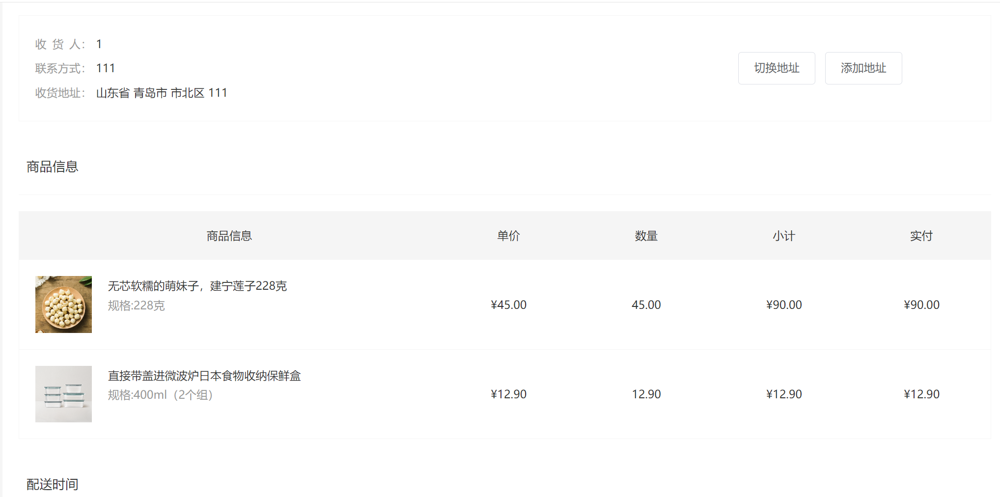
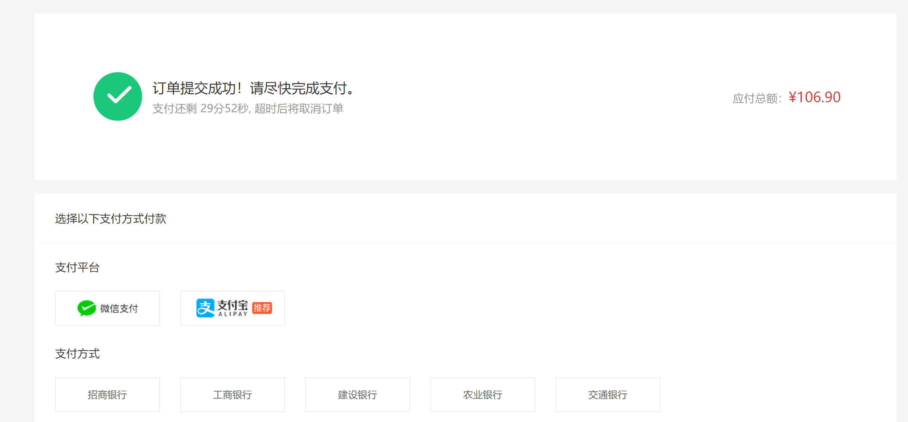

# 购物商城项目-Vue3

接口文档地址：

- https://apifox.com/apidoc/shared-c05cb8d7-e591-4d9c-aff8-11065a0ec1de/api-67132167

## 1.项目简介

本项目是基于 vue3 的一个前端购物商城项目

代码编写工具：**VSCode + Volar (and disable Vetur) + JavaScript + gitee + ESLint**

配置环境：详情看 [vite.config.js](https://gitee.com/xu-junxian/vue3_shopping/blob/master/vite.config.js)

安装包：详情看 [package.json](https://gitee.com/xu-junxian/vue3_shopping/blob/master/package.json)

### 1.1 主要技术栈

- HTML、JavaScript、CSS、Axios
- 构建框架：Vue3
- 状态管理：pinia
- 构建工具：vite
- 组件库：element-plus
- 路由管理：vue-router

## 2.项目功能模块

| 页面       | 模块                       | 解决方案                                                                                 |
| :--------- | :------------------------- | :--------------------------------------------------------------------------------------- |
| 首页       | 推荐模块、分类模块         | 首页搭建框架、图片懒加载、触底加载、商品展示组件封装、导航置顶、路由滚动配置、面包屑导航 |
| 商品详情页 | 规格选择模块               | SKU 组件封装、面包屑导航、图片放大镜封装                                                 |
| 登录页     | 登录模块                   | 表单校验、持久化存储、获取 token 配置请求响应拦截器                                      |
| 购物车页   | 购物车模块                 | 弹窗购物车(首页架子中)、列表购物车、全选反选功能、登录与未登录购物车合并、持久化存储     |
| 订单页     | 地址模块、商品列表模块     | 地址切换、更新购物车、pinia 应用                                                         |
| 支付页     | 支付模块                   | 倒计时组件封装(dayjs)、跳转支付地址                                                      |
| 用户页     | 个人信息模块、订单状态模块 | 猜你喜欢、地址管理、tab 导航切换、订单分页控制、个人信息表单校验(增删改)                 |

## 3.项目图片展示

首页


首页一级分类


登录


商品详情


购物车


订单结算



支付



个人中心


## 4.项目安装

### 1.安装依赖

```sh
npm install
```

### 2.启动项目

```sh
npm run dev
```

### 3.打包项目

```sh
npm run build
```

## 尝试触发部署

projects/frontend/apps/mall-web-toC-pc/\*

## 包名

`@zo-java-resail/mall`

TODO: 为了提高开发效率，暂时将项目的包名改名简单的字符串值。

## 历史笔记记录

## 处理 vite 配置不能以符号链接的形式导入 ts 包的问题

### --import tsx 方案

`NODE_OPTIONS=\"--import tsx\"`，这个方案来修改 vite 的运行命令。

- https://github.com/vitejs/vite/issues/5370#issuecomment-2111746632

```json
{
	"scripts": {
		"dev": "vite",
		"dev:with-import-tsx": "cross-env NODE_OPTIONS=\"--import tsx\" pnpm exec vite"
	}
}
```

这个方案运行速度很慢，要 6 秒。记录该方案，但是不敢使用。

效率太低了，冷启动很慢。

### tsx 方案

用 tsx 实现动态导入依赖包的方案

- https://github.com/vitejs/vite/issues/5370#issuecomment-2417686698

缺点就是项目启动慢了很多，大约在 4 秒以内。

```ts
import { tsImport } from "tsx/esm/api";
const { getRouteName } = await tsImport("@ruan-cat/utils", import.meta.url);
```

## 尝试将 vite 项目改造成 nuxt 项目

其初衷是为了减少各种约定俗成的配置，配置越少越好，安装的依赖越少越好。

### 手动迁移项清单

这里列举全部从基础模板内手动迁移调整的内容：

- app.vue
- cli 启动命令
- dependencies 生产环境依赖
- .gitignore 文件忽略

### 手动删除的依赖

```json
{
	"unplugin-auto-import": "^0.18.6",
	"unplugin-element-plus": "^0.8.0",
	"unplugin-vue-components": "^0.27.5",
	"unplugin-vue-router": "^0.10.9",
	"vite-plugin-autogeneration-import-file": "^3.0.0",
	"vite-plugin-vue-devtools": "^7.6.8",
	"vue-tsc": "^2.1.10",
	"sass": "^1.82.0",
	"typescript": "^5.7.2"
}
```

## 排查 nuxt 化项目启动报错的故障

- plugins
  插件文件夹的配置，不会导致 bug。
- assets 无故障
- vite 配置文件 无故障
- apis 无故障
- components 无故障
- composables 无故障
- directives 无故障

- models 无故障
- router 无故障
- settings 无故障
- stores 无故障
- styles 无故障
- utils 无故障
